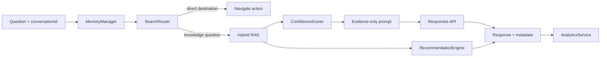

# Ask Mantosh intelligence layer

The intelligence layer sits between the public API and retrieval/model calls. It
uses deterministic decisions wherever possible, then sends only evidence and a
bounded memory view to the model.

## Components

| Component | Responsibility | Future seam |
| --- | --- | --- |
| `MemoryManager` | Session transcript, extractive compression, TTL cleanup, retrieval query context | Replace D1 storage with an authenticated user memory store. |
| `SearchRouter` | Resolve obvious page-intent commands before retrieval | Add sitemap aliases and authenticated deep links. |
| `MetadataService` | Read public document metadata and destinations | Add editorial priority, difficulty, and content-type facets. |
| `RecommendationEngine` | Select related public documents and deterministic follow-ups | Add personalization only with explicit consent. |
| `ConfidenceScorer` | Report retrieval evidence—not model certainty | Calibrate against a labeled retrieval evaluation set. |
| `AnalyticsService` | Aggregate hashed event dimensions | Feed a dashboard or Analytics Engine without raw queries. |

## Session and compression policy

A conversation ID is generated when the client does not provide one. The Worker
persists at most six turns of user/assistant messages and a compact extractive
summary of earlier topics and cited sources. The complete transcript is never
re-sent to OpenAI. Sessions expire after `CONVERSATION_TTL_SECONDS` (24 hours
by default); no user identity is required today.

When authentication is added, bind `conversation_sessions.subject_id` to a
verified subject and scope every read/write by that subject. Do not infer an
identity from IP address, browser fingerprint, or analytics data.

## Confidence semantics

`confidence` is `high`, `medium`, or `low`. It measures retrieval evidence,
not whether a model sounds certain. `confidenceDetails` exposes the best vector
similarity, lexical candidate count, retrieved source count, and selected
context count. A low-confidence query returns the fixed knowledge-gap answer
without calling the Responses API.

## Recommendation and analytics privacy

Recommendations are selected from indexed public document `tags` and
`related_topics`; the model does not invent them. The click endpoint hashes its
document identifier before storing an event counter. Search analytics likewise
hash the normalized topic dimension. Keep dashboards aggregate-only and use
retention appropriate to local privacy policy.

## Scaling without redesign

- Add account-scoped sessions and bookmarks with a `subject_id` index.
- Add a separate user-profile store only after consent and deletion workflows exist.
- Route model calls through a `ModelProvider` adapter for model fallbacks or a local LLM.
- Version Vectorize indexes when changing embedding models or dimensions; dual-write during cutover.
- Add metadata indexes and an evaluation set before adjusting ranking weights.
- Move analytics to Analytics Engine when dashboard volume exceeds D1 aggregation needs.
