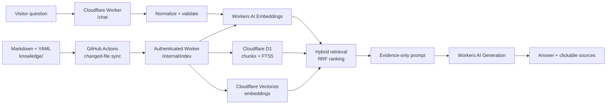

# Ask Mantosh: retrieval architecture

Ask Mantosh is an evidence interface to published engineering work. It is not a
general-purpose chatbot. A response is allowed only when the retrieval layer
finds public, published evidence.

## System shape



## Query sequence

```mermaid
sequenceDiagram
  participant V as Visitor
  participant W as Worker
  participant E as Workers AI Embeddings
  participant X as Vectorize
  participant D as D1 FTS5
  participant G as Workers AI Generation

  V->>W: POST /chat {question}
  W->>W: Validate and normalize
  W->>E: Embed question (audience excluded)
  par Retrieve candidates
    W->>X: Semantic top 16
    W->>D: BM25 top 16
  end
  W->>W: Reciprocal-rank fusion; select ≤5 chunks / 8k chars
  alt no public evidence
    W-->>V: "I haven't written about this topic yet."
  else evidence found
    W->>G: Instructions + retrieved chunks only
    G-->>W: Grounded answer
    W-->>V: answer + source labels + clickable URLs
  end
```

## Search decision

| Approach | Strength | Limitation | Decision |
| --- | --- | --- | --- |
| Static JSON | Lowest setup cost for a handful of documents | Transfers/searches the corpus at the edge; weak ranking | Do not use as the primary index. |
| Keyword only | Exact project names, acronyms, and technologies | Misses paraphrases and conceptual questions | Use through D1 FTS5/BM25. |
| Embeddings only | Strong semantic recall | Can miss precise identifiers and surface plausible near-matches | Use through Vectorize, with a score threshold. |
| Hybrid | Combines exact and semantic recall | Two retrieval calls and rank fusion | **Recommended.** |

D1 holds canonical, searchable text and Vectorize holds vectors plus minimal
metadata. Reciprocal-rank fusion avoids brittle score calibration across BM25
and cosine similarity. The data model works unchanged at 10, 100, 500, and
2,000+ documents; increase candidate counts, add metadata filters, and add
observability before considering another search platform.

## Chunking

The indexer converts Markdown into 1,500-character sliding-window chunks with
200 characters of overlap, prefixed by the document title and summary.

- Paragraph-only chunks preserve prose boundaries but often lack the decision
  context that appears in the preceding paragraph.
- Heading-only chunks are too variable: a long architecture section can exceed
  the model context budget while a short section lacks evidence.
- Semantic chunking can improve boundary quality, but adds an LLM dependency to
  every publish and is not justified for this corpus size.
- The fixed sliding window is deterministic, low-maintenance, and maintains
  enough adjacent context for engineering trade-offs.

Keep a chunk below 2,000 characters. Keep headings and the YAML summary concise;
they influence both FTS ranking and semantic retrieval.

## Ranking

Retrieval uses two independent candidate lists:

1. Vectorize semantic candidates above the configured cosine threshold.
2. D1 BM25 candidates from title, summary, body, and tags.
3. Reciprocal-rank fusion joins the lists. Document title, summary, tags, and
   metadata are intentionally included in the lexical index.
4. The Worker resolves fused IDs from D1, verifies `visibility = public`, and
   enforces the context budget.

Freshness and manual importance are metadata hooks, not ranking inputs today.
Add them only after an evaluation set demonstrates that recency or editorial
priority improves result quality; otherwise they risk suppressing enduring work.

## Prompt boundary

The model receives instructions separately from retrieved text. Retrieved text
is labelled as untrusted reference data and cannot override the instructions.
The model must answer only from the supplied documents, cite the exact source
label, and use the fixed unavailable-answer string when evidence is absent.
The Worker does not return the system prompt or upstream errors.

## Operations and evolution

- Adding a Markdown document requires no code or prompt change; a push to
  `main` invokes the changed-file indexer.
- Updates are idempotent. Deletes and renames remove old vectors and D1 rows.
- Use `visibility: draft` or `private` for material that must never reach the
  public index.
- Add a small evaluation fixture set before changing embedding models,
  thresholds, chunk size, or ranking weights.
- Add Analytics Engine events for query latency, zero-result rate, retrieval
  source count, and model-fallback rate. Never log raw questions or chunks.

Implemented and future capabilities remain behind small components:

| Capability | Extension point |
| --- | --- |
| Conversation memory | Implemented with bounded D1 sessions and extractive summaries; never replaces evidence retrieval. |
| Suggested questions / related articles | Implemented from retrieved public metadata without an additional generative call. |
| Caching | Implemented through Cloudflare Cache API for eligible embeddings, retrieval results, and first-turn responses; KV version invalidation remains optional. |
| Multiple or local embedding models | Create a versioned Vectorize index and dual-write during migration; never mix dimensions in one index. |
| Higher-scale retrieval | Add category/tag filters and metadata indexes, then re-rank a bounded candidate set. |

## Security controls

- Automatic indexing uses a short-lived GitHub OIDC token constrained to the repository, workflow, and `main` branch. `INDEXER_TOKEN` remains a Worker-only manual recovery secret.
- The index route has no CORS headers and accepts verified GitHub identity or a timing-safe recovery-token comparison.
- Only expected category directories and public URLs are accepted at ingestion.
- D1 queries use prepared parameters; FTS terms are tokenized before matching.
- Answers contain only model output and approved public source metadata.
- Exact-origin CORS, request limits, timeout handling, D1 counters, and the
  configured mandatory Cloudflare rate-limiter binding protect the public route.
