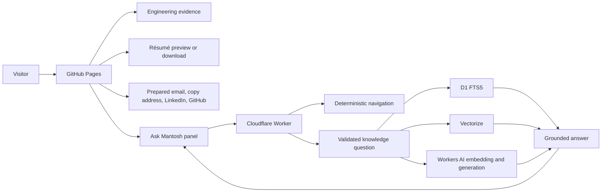

# Production system state

Verified: 2026-07-12

This document is the canonical description of what is deployed. Architecture proposals and future operating standards in other documents must not be read as already implemented unless they also appear here or in executable configuration.

## Production endpoints

| Surface | Endpoint | Current role |
| --- | --- | --- |
| Website | `https://mantoshkumar1.github.io/` | Static engineering portfolio and publication |
| Ask Mantosh | `https://ask-mantosh.mantoshk234.workers.dev/` | Public evidence-backed question endpoint; accepts `POST /` and `POST /chat` |
| Health | `https://ask-mantosh.mantoshk234.workers.dev/health` | Unauthenticated service health without configuration details |
| Knowledge indexing | `POST /internal/index` | GitHub OIDC or manual recovery token only; intentionally unavailable to browsers through CORS |

## Published inventory

- Seventeen SEO-configured HTML documents: home, projects index, three project case studies, Insights index, six engineering articles and notes, experience, résumé, contact, accessibility statement, and custom 404.
- 11 public Ask Mantosh documents: three project sources, six Insights sources, one résumé-backed engineering-capabilities source, and one evidence-backed profile and fit guide.
- One résumé PDF served for in-browser preview and explicit download.
- Sitemap, RSS feed, `robots.txt`, `llms.txt`, JSON-LD, Open Graph, Twitter Card, manifest, icons, and a 1200×630 social image.
- A visitor-controlled Auto, Light, and Dark appearance setting that follows the operating system by default and persists explicit choices on the device.

## Visitor flows

The chat UI streams the response, sanitizes rendered Markdown, presents canonical source chips, preserves server-provided follow-up questions, supports retry/copy actions, traps focus, closes through its button, backdrop, or Escape key, and reports a clear recovery message when the service cannot be reached.

## Knowledge publication flow

1. A reviewed document with complete YAML front matter is committed under `knowledge/`.
2. A push to `main` triggers `.github/workflows/sync-knowledge.yml` for relevant paths.
3. GitHub issues a short-lived OIDC token with audience `ask-mantosh-indexer`.
4. The Worker verifies token signature, repository, workflow, branch, event, audience, and expiry.
5. The indexer validates, chunks, embeds, and upserts public documents into D1 and Vectorize; deletes and renames remove prior records.
6. Draft and private documents remain excluded from public retrieval.

## Runtime configuration

The committed production configuration uses:

- exact allowed origin `https://mantoshkumar1.github.io`;
- Workers AI model `@cf/meta/llama-3.1-8b-instruct-fast`;
- embedding model `@cf/baai/bge-m3` with the 1024-dimension `ask-mantosh-knowledge-v3` Vectorize index;
- D1 database `personal-website-knowledge`;
- five retrieved chunks and an 8,000-character context budget;
- 20-second AI timeout, 450 output-token cap, and 6,000-character answer cap;
- five requests per minute through both the Cloudflare rate-limiter binding and D1 safety counter;
- 50 AI-bearing requests per UTC day through D1;
- six retained conversation turns and a 24-hour session TTL.

Cloudflare Cache API stores eligible embeddings, retrieval candidates, and first-turn answers for 15, 5, and 10 minutes respectively. The optional `CACHE_VERSION` KV binding is not configured in the committed production file, so cache invalidation currently relies on TTL expiry and the fallback version. This is an explicit known limitation, not an undocumented guarantee.

## Security and privacy controls

- Exact-origin CORS; no browser bearer secret and no cookie authentication.
- Mandatory Cloudflare rate-limiter binding plus strict D1 minute/day counters; the Worker fails closed when the mandatory limiter is unavailable.
- JSON validation, 16 KiB body cap, normalized bounded questions, timeouts, output-size checks, and generic provider errors.
- Evidence-only prompting, public-visibility filtering, prompt-injection boundaries, approved citation URLs, and sanitized frontend Markdown.
- CSP, HSTS, `nosniff`, frame denial, restrictive permissions policy, and no-referrer on Worker responses.
- No raw question text, IP address, authorization header, or cookie storage in analytics; only aggregate hashed dimensions.

## Deployment and verification

GitHub Pages and technical audits run automatically on pushes to `main`. Worker deployment is a separate Wrangler operation; D1 migrations are additive and must be applied before code that depends on them. The production Worker exposes `/health`, and knowledge synchronization is independent of Worker deployment.

The repository currently enforces:

- static build and SEO generation;
- indexable-page structure and metadata checks;
- crawler/discoverability checks;
- internal link, fragment, and asset validation;
- documentation drift checks;
- autonomous content-lane counts and explicit zero-content states;
- 33 Worker contract, security, quota, OIDC, retrieval, intent-formatting, prompt, and failure-path tests.

## Known limits

- Only 11 public knowledge documents are indexed; Ask Mantosh intentionally declines questions outside them.
- Public evidence has no fabricated employer metrics or inferred organizational outcomes.
- The Worker uses the Cloudflare free allocation and may return a clear 429 when safety or provider limits are reached.
- There is no authenticated user account, durable personal profile, staging environment declared in this repository, formal accessibility conformance audit, or labeled offline retrieval-evaluation set.
- The website origin is GitHub Pages rather than a custom domain.

These limits are deliberate or visible. They should change only with evidence, operational need, and updated documentation.
