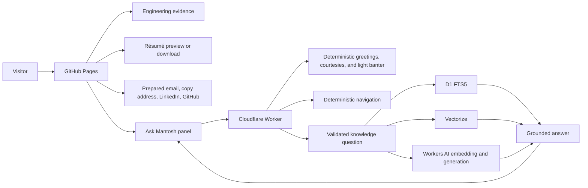

# Production system state

Verified: 2026-07-13

This document is the canonical description of what is deployed. Architecture proposals and future operating standards in other documents must not be read as already implemented unless they also appear here or in executable configuration.

## Production endpoints

| Surface | Endpoint | Current role |
| --- | --- | --- |
| Website | `https://mantoshkumar1.github.io/` | Static engineering portfolio and publication |
| Ask Mantosh | `https://ask-mantosh.mantoshk234.workers.dev/` | Public evidence-backed question endpoint; accepts `POST /` and `POST /chat` |
| Health | `https://ask-mantosh.mantoshk234.workers.dev/health` | Unauthenticated service health without configuration details |
| Knowledge indexing | `POST /internal/index` | GitHub OIDC or manual recovery token only; intentionally unavailable to browsers through CORS |

Last verified Worker deployment: `22786bb9-a4e5-4a25-89ba-8f22009a9bdb`. The active answer-policy cache namespace is `visitor-intent-v16`.

## Published inventory

- SEO-configured public pages: home, projects index, five project case studies, Insights index, six engineering articles and notes, experience, résumé, contact, a live Buttondown email subscription with RSS, accessibility statement, and custom 404.
- 14 public Ask Mantosh documents: five project sources, six Insights sources, two résumé-backed experience and academic-achievement sources, and one evidence-backed profile and fit guide.
- One résumé PDF served for in-browser preview and explicit download.
- Sitemap, RSS feed, `robots.txt`, `llms.txt`, JSON-LD, Open Graph, Twitter Card, manifest, icons, and a 1200×630 social image.
- A visitor-controlled Auto, Light, Dark, Soft, and High contrast appearance setting. Dark is the first-visit default; explicit choices persist on the device, and Auto follows the operating system.
- English remains the authoritative content language. Pages expose standard language metadata and selectable text for browser translation; the site does not infer language from location or load a third-party translation widget.
- Single-destination Insight cards expose the whole card as one link, while project cards preserve separate case-study, product, and source destinations. Long-form Insight pages use a compact reading rhythm distinct from broader landing-page spacing.
- Page density is intentional: homepage sections render at their real height without synthetic off-screen placeholders; landing, case-study, article, and mobile shells use separate compact spacing scales so the next useful decision arrives sooner without reducing touch-target size.

## Visitor flows

The chat UI streams the response, sanitizes rendered Markdown, presents canonical source chips, preserves server-provided follow-up questions, supports retry/copy actions, traps focus, minimizes without losing the session, and provides an explicit close-and-clear action. Simple greetings, thanks, farewells, capability questions, and bounded light banter receive deterministic conversational replies without retrieval or AI use. Natural profile wording—including questions about what kind of person or engineer Mantosh is—routes to the published professional profile and technical evidence without inferring private personality. Subjective praise or skepticism is answered as opinion followed by concise published evidence. Unsupported topics receive a helpful scope boundary instead of implying that Mantosh personally has not written about them. If the model omits its Sources section, the Worker inserts the canonical retrieved source rather than exposing an internal citation-formatting failure.

## Knowledge publication flow

1. A reviewed document with complete YAML front matter is committed under `knowledge/`.
2. A push to `main` triggers `.github/workflows/sync-knowledge.yml` for relevant paths.
3. GitHub issues a short-lived OIDC token with audience `ask-mantosh-indexer`.
4. The Worker verifies token signature, repository, workflow, branch, event, audience, and expiry.
5. The indexer validates, chunks, embeds, and upserts public documents into D1 and Vectorize; deletes and renames remove prior records.
6. Draft and private documents remain excluded from public retrieval.

## Runtime configuration

The committed production configuration uses:

- exact allowed origin `https://mantoshkumar1.github.io`;
- Workers AI model `@cf/meta/llama-3.1-8b-instruct-fast`;
- embedding model `@cf/baai/bge-m3` with the 1024-dimension `ask-mantosh-knowledge-v3` Vectorize index;
- D1 database `personal-website-knowledge`;
- five retrieved chunks and an 8,000-character context budget;
- 20-second AI timeout, 450 output-token cap, and 6,000-character answer cap;
- five requests per minute through both the Cloudflare rate-limiter binding and D1 safety counter;
- 50 AI-bearing requests per UTC day through D1;
- six retained conversation turns and a 24-hour session TTL.

Cloudflare Cache API stores eligible embeddings, retrieval candidates, and first-turn answers for 15, 5, and 10 minutes respectively. The optional `CACHE_VERSION` KV binding is not configured in the committed production file, so knowledge-index invalidation currently relies on TTL expiry and the fallback version. Answer-policy changes explicitly advance `ANSWER_POLICY_VERSION`—currently `visitor-intent-v16`—to avoid serving a response cached under an older formatter or prompt contract. This is an explicit known limitation, not an undocumented guarantee.

## Security and privacy controls

- Exact-origin CORS; no browser bearer secret and no cookie authentication.
- Mandatory Cloudflare rate-limiter binding plus strict D1 minute/day counters; the Worker fails closed when the mandatory limiter is unavailable.
- JSON validation, 16 KiB body cap, normalized bounded questions, timeouts, output-size checks, and generic provider errors.
- Evidence-only prompting, public-visibility filtering, prompt-injection boundaries, approved citation URLs, and sanitized frontend Markdown.
- Low-information questions are clarified before retrieval, and semantic-only matches below 0.40 cannot trigger generation without lexical support.
- CSP, HSTS, `nosniff`, frame denial, restrictive permissions policy, and no-referrer on Worker responses.
- No raw question text, IP address, authorization header, or cookie storage in analytics; only aggregate hashed dimensions.

## Deployment and verification

GitHub Pages and technical audits run automatically on pushes to `main`. Worker deployment is a separate Wrangler operation; D1 migrations are additive and must be applied before code that depends on them. The production Worker exposes `/health`, and knowledge synchronization is independent of Worker deployment.

The repository currently enforces:

- static build and SEO generation;
- indexable-page structure and metadata checks;
- crawler/discoverability checks;
- internal link, fragment, and asset validation;
- documentation drift checks;
- autonomous content-lane counts and explicit zero-content states;
- 47 Worker contract, deterministic social, light-banter, and achievement routing, natural profile-language routing, security, quota, OIDC, retrieval, concise intent-formatting, prompt, citation-repair, and failure-path tests, plus static UI guards for immediate safe Markdown rendering.

## Known limits

- Only 14 public knowledge documents are indexed; outside deterministic greetings, courtesies, light banter, and navigation, Ask Mantosh keeps answers within published evidence and clearly redirects unsupported topics.
- Public evidence has no fabricated employer metrics or inferred organizational outcomes.
- The Worker uses the Cloudflare free allocation and may return a clear 429 when safety or provider limits are reached.
- There is no authenticated user account, durable personal profile, staging environment declared in this repository, formal accessibility conformance audit, or labeled offline retrieval-evaluation set.
- The website origin is GitHub Pages rather than a custom domain.

These limits are deliberate or visible. They should change only with evidence, operational need, and updated documentation.
