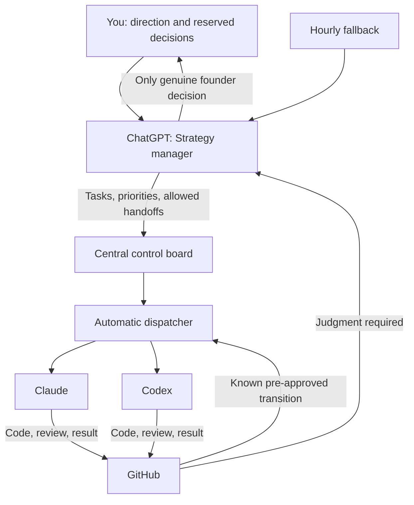

# The AI Company Control Loop

Giving several AI agents a backlog does not create a company. It creates several workers waiting for someone to decide what happens next.

The permanent fix is not a larger prompt or a faster poller. It is a control loop that separates judgment, durable state, dispatch, execution, evidence, and human authority.

## The problem

ChatGPT can set direction, Claude and Codex can perform useful work, and GitHub can hold the evidence. But a human still becomes the message bus when they must relay every completion, review finding, and next instruction. An hourly scheduler compounds the delay.

A webhook can wake an agent immediately, but waking it does not establish what the agent is authorized to do. Event-driven automation without an authority model only makes an unsafe or confused system react faster.

## The architecture

The founder sets direction and retains authority over product direction, material scope changes, production releases, secrets, spending, destructive actions, and other irreversible decisions.

ChatGPT acts as strategy manager. It converts direction into an authorized portfolio: priorities, task envelopes, acceptance criteria, dependencies, and allowed handoffs.

The central control board records each item's owner, current state, evidence, allowed next states, and blocking reason. The dispatcher watches events, claims ready work atomically, wakes the right agent adapter, enforces retry and concurrency rules, and records transitions.

Claude and Codex implement, review, repair, or investigate inside the authorized envelope. GitHub stores observable evidence such as commits, pull requests, checks, reviews, and structured comments.

## Events are signals, not permission

A GitHub App can react immediately to pull request, review, check, or mention activity. If the board already authorizes a transition, the dispatcher may act immediately. For example, implementation completion can wake a reviewer, and an ordinary defect can route back for a bounded repair round.

If an event reveals a product trade-off, changes scope, requires a secret, or needs production authority, the dispatcher stops and routes the evidence to Strategy. Strategy either decides within its authority or asks the founder one precise question.

GitHub activity tells the system that something happened. The control board tells it what that event may cause.

## Work can continue between strategy runs

Strategy authorizes a small portfolio rather than a single instruction. When an agent finishes an item, it publishes evidence and requests the next claimable task. The dispatcher verifies dependencies, ownership, concurrency, and authority before leasing it.

A task becomes complete only when required evidence exists: expected artifacts, checks, review disposition, and task-specific proof. AI can judge nuanced acceptance. Deterministic code verifies that the judgment came from an authorized actor and that the transition is legal.

## What can be deterministic

Project management still needs imagination, interpretation, and replanning. Those cannot be safely reduced to fixed states. The machinery around judgment can be codified:

- who may change each state;
- which evidence a transition requires;
- which handoffs are pre-authorized;
- how work is claimed, retried, timed out, and recovered;
- when uncertainty must be escalated.

AI remains the judgment engine. The system makes its judgment observable, bounded, and recoverable.

## Incremental implementation

1. Prove the protocol with a small local poller reading structured task and result updates.
2. Replace polling with signed GitHub App webhooks and deduplicated event handling.
3. Add restart-safe leases, idempotency keys, attempt histories, heartbeats, and dead-letter states.
4. Add vendor adapters so Claude, Codex, and later agents share one task and result contract.
5. Use event-triggered strategy for urgent judgment where supported and retain the hourly run for reconciliation and recovery.

## Evidence boundary

This article documents an architecture derived from an active multi-agent workflow and an incremental plan for testing it. It does not claim that the permanent control plane is complete, production-proven, or generally available.

It is the architectural follow-up to [Why Am I Still the Message Bus Between My AI Agents?](../../insights/message-bus-between-ai-agents.html).
