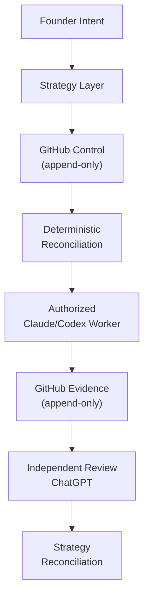

# DogBuild

DogBuild is an experimental deterministic control and orchestration layer for coordinating multiple AI coding agents (Claude Code, Cursor, Codex) through GitHub and curated MCP interfaces, without requiring a human to manually relay context between them.

## The Problem

AI agents can implement and review work, but without a durable control plane, the human becomes the message bus:

- Implementation agent completes work → human copies result to reviewer
- Reviewer provides findings → human carries feedback back to implementer
- Every round of fixes requires manual relay

DogBuild explores how intent, authority, evidence, routing, and handoffs can become deterministic and auditable instead of requiring manual transport between agents.

## Core Design Principles

- **GitHub records live control and execution state.** Chat is a control/wake interface only; evidence and routing decisions live on GitHub.
- **DogBuild contains no AI and makes no semantic product decisions.** It enforces boundaries and routes work; humans and specialized agents make product calls.
- **Strategy carries founder intent and assigns work.** The human decides anything irreversible.
- **Workers do not self-start or broaden their authority.** Every task is explicitly bounded and reviewed.
- **Worker plans, findings, and verdicts are append-only on GitHub.** Corrections supersede earlier evidence without silently rewriting history.
- **Exact identity must be revalidated before writes.** Repository, task, role, generation, target, and requested effect are all subject to fresh validation.

## Architecture

The intended architecture flows from founder intent through a strategy layer, onto GitHub as a control plane, through deterministic reconciliation to authorized workers, and back to GitHub for evidence. Independent review by ChatGPT reconciles findings back to strategy.

## Current Status

DogBuild is under active development and is not yet a production-ready autonomous-agent platform. Lived dogfooding is validating the approach; several components remain in review or deferred pending verification.

Key milestones achieved:
- Defined founder/Strategy/worker authority model
- Made GitHub the durable communication and evidence layer for live state
- Built and validated a three-server MCP portal path
- Inventoried and classified 53 live MCP tools
- Implemented a narrow read-only DogBuild control-server package
- Built a deterministic listener prototype and identified safety gaps

## What This Project Demonstrates

- Authority hierarchies that remain clear and mechanically enforced across agent boundaries.
- Append-only evidence models that prevent silent history rewrites while still supporting corrections.
- GitHub as a durable, auditable control plane instead of hidden chat state.
- Deterministic routing and identity validation to replace manual context relay.
- Boundary enforcement that keeps each agent operating within its authority scope.
- Design principles that favor failing closed when evidence is unclear over guessing.

## Reflection

The core insight is that multi-agent coordination fails when the human becomes the message bus. Once agents can read and write to a shared, append-only evidence store (GitHub), and once authority is explicit and revalidated before each write, manual relay becomes unnecessary. The challenge is building the governance layer that keeps every agent honest about its authority scope — not harder than multi-agent reasoning, but orthogonal to it.

Full account: [`vision.md`](https://github.com/mantoshkumar1/dogbuild/blob/main/vision.md) on the DogBuild repository.

